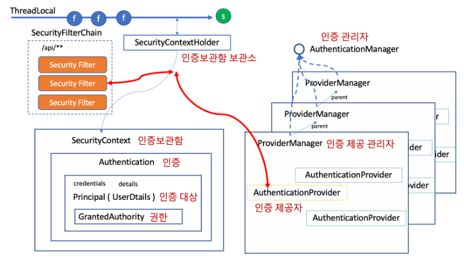

## 스프링 시큐리티 로그인

- 스프링 시큐리티를 이용해 로그인을 하면 스프링 시큐리티가 세션을 생성하고 (SecurityContext) 이 세션 안에 Authentication 객체를 생성하고 Authentication 객체 안에 로그인 정보를 Principal(UserDetail) 객체 안에 저장한다.

- 로그인을 하게되면 선택한 로그인 방식에 따라서 인증토큰(Authentication)을 발행한다.

| 필터                                 | 인증토큰                                                     |
| :----------------------------------- | :----------------------------------------------------------- |
| UsernamePasswordAuthenticationFilter | 폼 로그인 -> UsernamePasswordAuthenticationToken             |
| RememberMeAuthenticationFilter       | remember-me 쿠키 로그인 -> RememberMeAuthenticationToken     |
| AnonymousAuthenticationFilter        | 로그인하지 않았다는 것을 인증함 -> AnonymousAuthenticationToken |
| SecurityContextPersistenceFilter     | 기존 로그인을 유지함(기본적으로 session 을 이용함)           |
| BearerTokenAuthenticationFilter      | JWT 로그인                                                   |
| BasicAuthenticationFilter            | ajax 로그인 -> UsernamePasswordAuthenticationToken           |
| OAuth2LoginAuthenticationFilter      | 소셜 로그인 -> OAuth2LoginAuthenticationToken, OAuth2AuthenticationToken |
| OpenIDAuthenticationFilter           | OpenID 로그인                                                |
| Saml2WebSsoAuthenticationFilter      | SAML2 로그인                                                 |

