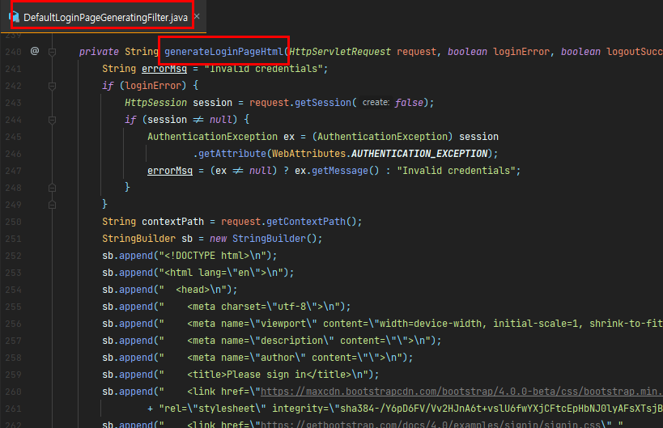
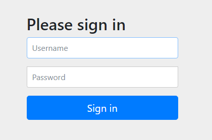
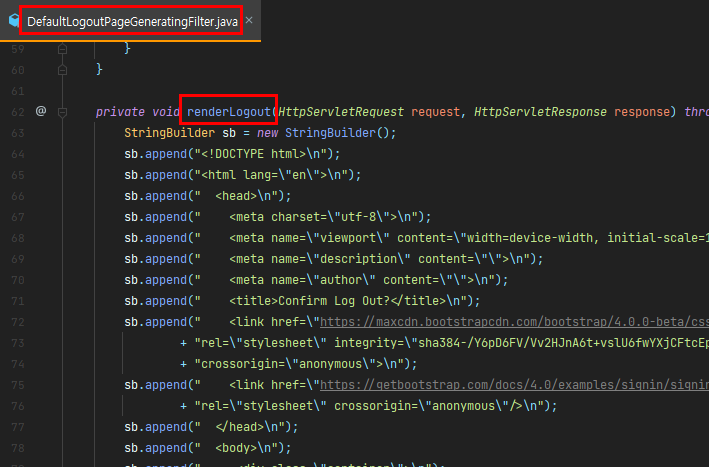
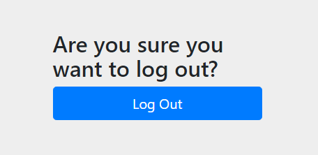

# 폼 로그인

##### DefaultLoginPageGeneratingFilter

- 스프링 시큐리티가 기본적으로 제공하는 로그인 폼을 제공
- GET /login 을 처리 



- 내부에서 로그인 페이지를 생성하고 있다. 해당 페이지는 다음과 같다.




---

##### UsernamePasswordAuthenticationFilter

- POST /login 을 처리. (주소 변경 가능)

- 로그인 성공, 실패 시 이동 할 주소를 지정 할 수 있다.

###### < SecurityConfig.java >

```java
@Override
protected void configure(HttpSecurity http) throws Exception {

    http
        .headers().disable()
        .csrf().disable()
        .authorizeRequests().anyRequest().authenticated()
        .and()
        .formLogin()
        .defaultSuccessUrl("/", false)  // false 옵션은 로그인 성공시 루트 페이지로 가는 것을 방지
        .failureForwardUrl("/"); // 로그인 실패시 이동 페이지
}
```


---

##### DefaultLogoutPageGeneratingFilter

- GET /logout 을 처리
- POST /logout 을 요청할 수 있는 UI 를 제공
- DefaultLoginPageGeneratingFilter 를 사용하는 경우에 같이 제공됨.



- 기본 제공 로그아웃 페이지 



- Log Out 버튼 클릭시 POST /logout 요청


---

##### LogoutFilter

- POST /logout 을 처리. processiongUrl 을 변경하면 바꿀 수 있음.
- 로그 아웃을 처리
  - session, SecurityContext, csrf, 쿠키, remember-me 쿠키 등을 삭제처리 함.
  - (기본) 로그인 페이지로 redirect