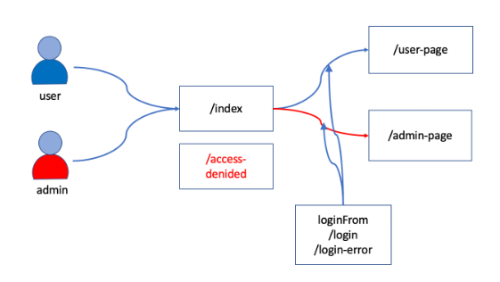
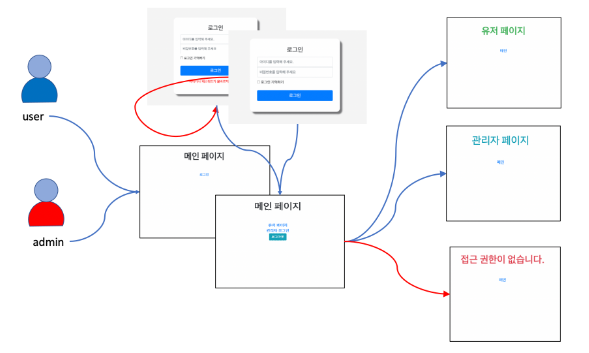
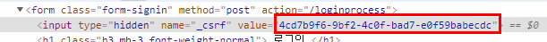
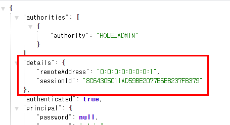
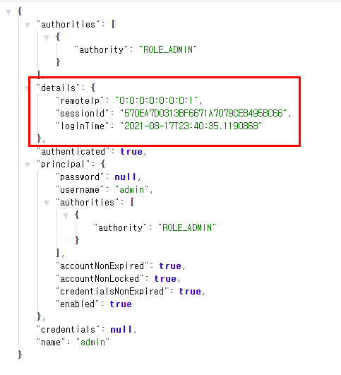

### basic login

- 다음과 같은 사이트로 기본 로그인 실습






### 시큐리티 설정

- thymeleaf 에 대한 의존성 추가

```groovy
implementation("$boot:spring-boot-starter-thymeleaf")
implementation("org.thymeleaf.extras:thymeleaf-extras-springsecurity5")
implementation("nz.net.ultraq.thymeleaf:thymeleaf-layout-dialect")
```


- 정적 리소스 시큐리티 적용 되지 않도록 설정

```java
@Override
public void configure(WebSecurity web) throws Exception {
    // 정적 리소스는 시큐리티 적용 X
    web.ignoring()
        .requestMatchers(PathRequest.toStaticResources().atCommonLocations());
}
```


- csrf 설정
  - 타임리프 사용시 form 태그에 th:action 태그를 사용하면 csrf 토큰을 가지고 넘어간다.

```html
<form class="form-signin" method="post" th:action="@{/login}">
```




- 타임리프에서 시큐리티 적용 태그

```html
<div sec:authorize="isAuthenticated()">
  인증되었을 때만 보이는 메뉴
</div>
<div sec:authorize="hasRole('ROLE_ADMIN')">
  어드민 권한을 가지고 있을 때만 보이는 메뉴
</div>
<div sec:authorize="hasRole('ROLE_USER')">
  유저 권한을 가지고 있을 때만 보이는 메뉴
</div>
```


- 권한 계층 설정( 관리자는 유저 권한도 가지도록 )

```java
@Bean
RoleHierarchy roleHierarchy() {
    RoleHierarchyImpl roleHierarchy = new RoleHierarchyImpl();
    roleHierarchy.setHierarchy("ROLE_ADMIN > ROLE_USER");
    return roleHierarchy;
}
```


- 시큐리티 설정

```java
@Override
protected void configure(HttpSecurity http) throws Exception {
    http
        .authorizeRequests()
        .antMatchers("/").permitAll()
        .anyRequest().authenticated()

        // 로그인 성공시, 실패시
        .and()
        .formLogin().loginPage("/login").permitAll()
        .defaultSuccessUrl("/", false)
        .failureUrl("/login-error")
        .authenticationDetailsSource(customAuthDetails) // 커스텀

        // 로그아웃 설정
        .and()
        .logout().logoutSuccessUrl("/")

        // 예외 발생시 설정
        .and()
        .exceptionHandling().accessDeniedPage("/access-denied");
}
```


- UserDetailsSource 를 커스텀으로 설정

```java
@Component
public class CustomAuthDetails implements AuthenticationDetailsSource<HttpServletRequest, RequestInfo> {
    @Override
    public RequestInfo buildDetails(HttpServletRequest request) {
        return RequestInfo.builder()
                .remoteIp(request.getRemoteAddr())
                .sessionId(request.getSession().getId())
                .loginTime(LocalDateTime.now())
                .build();
    }
}
```

```java
public class RequestInfo {

    private String remoteIp;
    private String sessionId;
    private LocalDateTime loginTime;
}
```

- 기본 설정 시




- 커스텀 적용

