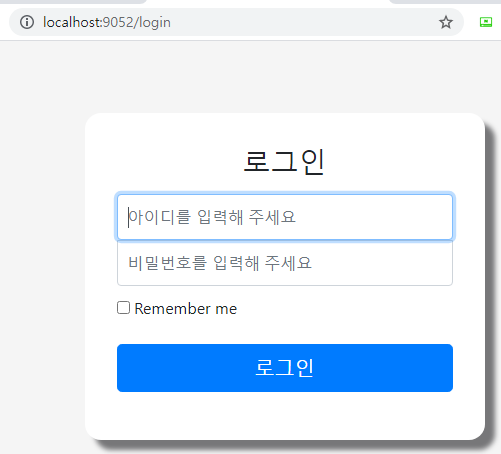
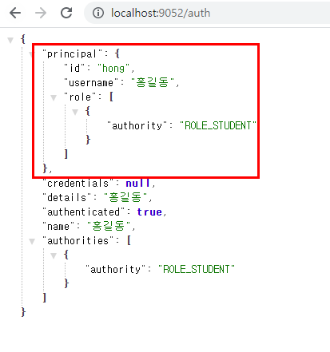

### 로그인 커스텀 필터

스프링 시큐리티가 기본적으로 제공하는 토큰과 인증 결과 외에도 커스텀 하여 관리 할 수 있다.

- 스프링 시큐리티의 Authentication 객체


- Authentication 는 인증된 결과만 저장하는 것이 아니고, 인증을 하기 위한 정보와 인증을 받기 위한 정보가 하나의 객체에 동시에 들어 있다. 
  - Credentials : 인증을 받기 위해 필요한 정보, 비번등 (input)
  - Principal : 인증된 결과. 인증 대상 (output)
  - Details : 기타 정보, 인증에 관여된 된 주변 정보들
  - Authorities : 권한 정보들
- Authentication 객체는 SecurityContextHolder 를 통해 세션이 있건 없건 언제든 접근할 수 있도록 필터체인에서 보장


#### 커스텀 Authentication 생성

- StudentAuthenticationToken 을 발급하여 Student를 저장 한다.

##### < Student >

- 인증 결과를 담을 객체

```java
@Data
@AllArgsConstructor
@NoArgsConstructor
@Builder
public class Student {

    private String id;
    private String username;
    private Set<GrantedAuthority> role; // Student가 가지는 권한
}
```


##### < StudentAuthenticationToken >

- 인증을 수행 하기 위한 토큰을 생성

```java
@Data
@AllArgsConstructor
@NoArgsConstructor
@Builder
public class StudentAuthenticationToken implements Authentication {

    private Student principal;
    private String credentials;
    private String details; 
    private boolean authenticated; // 인증 여부

    @Override
    public Collection<? extends GrantedAuthority> getAuthorities() {
        return principal == null ? new HashSet<>() : principal.getRole();
    }

    @Override
    public String getName() {
        return principal == null ? "" : principal.getUsername();
    }
}
```


##### < StudentManager >

- Authentication 객체를 받아 인증 하고 토큰을 발급

- 폼 로그인 사용시 UsernamePasswordAuthenticationFliter 를 통해서 UsernamePasswordAuthenticationToken 객체를 생성하여 해당 객체를 처리할 provider를 찾으므로 StudentManager 가 UsernamePasswordAuthenticationToken 를 처리할 수 있도록 한다.

  ```java
   @Override
      public boolean supports(Class<?> authentication) {
          return authentication == UsernamePasswordAuthenticationToken.class;
      }
  ```

  

```java
@Component
public class StudentManager implements AuthenticationProvider, InitializingBean {

    // DB 연동
    private HashMap<String, Student> studentDB = new HashMap<>();

    @Override
    public Authentication authenticate(Authentication authentication) throws AuthenticationException {
        UsernamePasswordAuthenticationToken token = (UsernamePasswordAuthenticationToken) authentication;

        // 토큰의 정보가 DB에 있으면 StudentAuthenticationToken 발급
       if (studentDB.containsKey(token.getName())) {
            Student student = studentDB.get(token.getName());
            return StudentAuthenticationToken.builder()
                    .principal(student)
                    .details(student.getUsername())
                    .authenticated(true)
                    .build();
        }
        return null; // 처리할 수 없는 인증은 null 을 리턴
    }

    @Override
    public boolean supports(Class<?> authentication) {
        return authentication == UsernamePasswordAuthenticationToken.class;
    }

    // 객체 생성시 수행 메소드 ( 초기 데이터 설정 )
     @Override
    public void afterPropertiesSet() throws Exception {
        Student student = new Student("hong", "홍길동", Collections.singleton(new SimpleGrantedAuthority("ROLE_STUDENT")));
        Student student1 = new Student("kang", "강아지", Collections.singleton(new SimpleGrantedAuthority("ROLE_STUDENT")));
        Student student2 = new Student("rang", "호랑이", Collections.singleton(new SimpleGrantedAuthority("ROLE_STUDENT")));

        studentDB.put(student.getId(), student);
        studentDB.put(student1.getId(), student1);
        studentDB.put(student2.getId(), student2);
    }
}
```


#### 커스텀 Authentication 등록

- SecurityConfig 에서 StudentManager 등록

```java
@EnableWebSecurity(debug = true)
public class SecurityConfig extends WebSecurityConfigurerAdapter {

    private final StudentManager studentManager;

    public SecurityConfig(StudentManager studentManager) {
        this.studentManager = studentManager;
    }

    @Override
    protected void configure(AuthenticationManagerBuilder auth) throws Exception {
        auth.authenticationProvider(studentManager); // 등록
    }

    @Override
    protected void configure(HttpSecurity http) throws Exception {
        http
                .authorizeRequests()
                .antMatchers("/").permitAll()
                .anyRequest().authenticated()
                .and()
                .formLogin().loginPage("/login").permitAll();
    }

    @Override
    public void configure(WebSecurity web) throws Exception {
        web.ignoring()
                .requestMatchers(PathRequest.toStaticResources().atCommonLocations())
                ;
    }
}
```


#### 필터 등록 확인

- 폼 로그인을 통해 로그인



- Authentication 확인

```java
@ResponseBody
@GetMapping("/auth")
public Authentication auth() {
    return SecurityContextHolder.getContext().getAuthentication();
}
```

- 설정 했던 Student 객체를 확인 할 수 있다.




- 여러 커스텀 필터를 등록하려면 다음과 같이 할 수 있다.

```java
@Override
protected void configure(AuthenticationManagerBuilder auth) throws Exception {
    auth.authenticationProvider(studentManager); // 등록
    auth.authenticationProvider(teacherManager);
}
```


---


#### 커스텀 필터 생성

```java
public class CustomLoginFilter extends UsernamePasswordAuthenticationFilter {

    public CustomLoginFilter(AuthenticationManager authenticationManager) {
        super(authenticationManager);
    }

    @Override
    public Authentication attemptAuthentication(HttpServletRequest request, HttpServletResponse response) throws AuthenticationException {
        String username = obtainUsername(request);
        username = (username != null) ? username : "";
        username = username.trim();
        String password = obtainPassword(request);
        password = (password != null) ? password : "";
        UsernamePasswordAuthenticationToken authRequest = new UsernamePasswordAuthenticationToken(username, password);
        return this.getAuthenticationManager().authenticate(authRequest);
    }
}
```

- 스프링 시큐리티의 기본 폼 로그인을 사용하지 않고 커스텀 필터를 생성하여 등록한다.

```java
@Override
protected void configure(HttpSecurity http) throws Exception {
    CustomLoginFilter filter = new CustomLoginFilter(authenticationManager());

    http
            .authorizeRequests()
            .antMatchers("/", "/login").permitAll()
            .anyRequest().authenticated()
            .and()
            .logout().logoutSuccessUrl("/")
            .and()
        	// 기존 필터 자리에 커스텀 필터를 넣는다.
            .addFilterAt(filter, UsernamePasswordAuthenticationFilter.class)
            .exceptionHandling().accessDeniedPage("/access-denied");
}
```