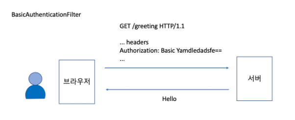
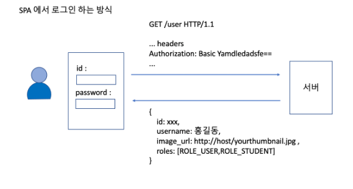
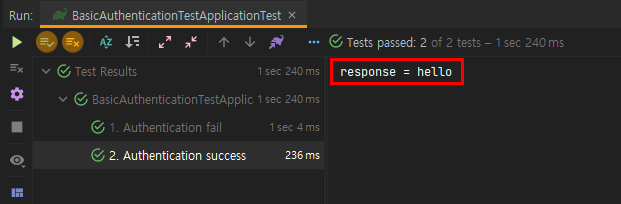
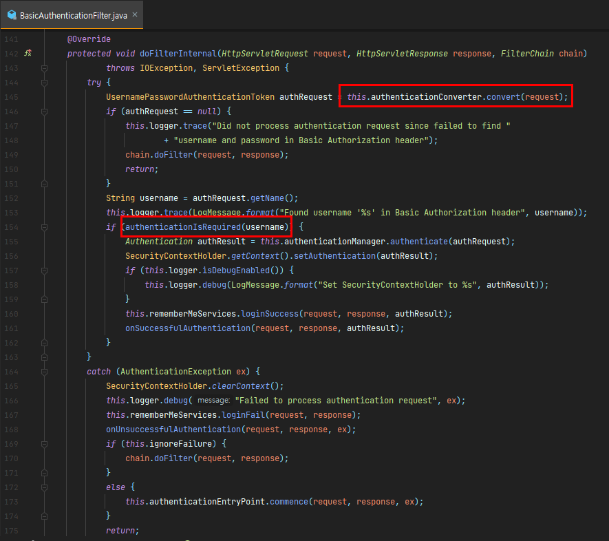
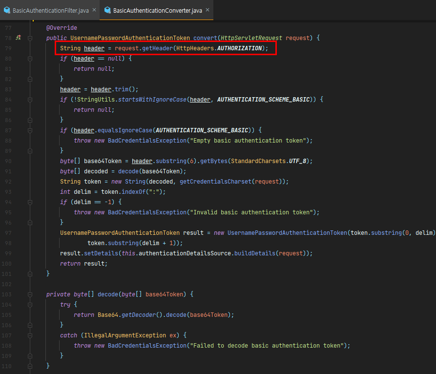
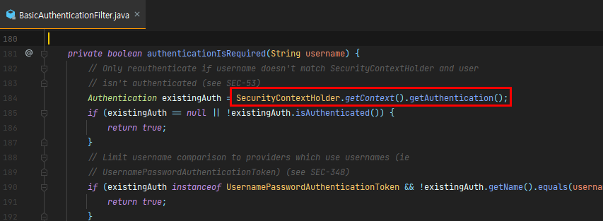

BasicAuthenticationFilter

- 기본적으로 로그인 페이지를 사용할 수 없는 상황에서 사용한다.
  - SPA 페이지 (react, angular, vue ...)
  - 브라우저 기반의 모바일 앱(브라우저 개반의 앱, ex: inoic )


- 설정 방법

```java
public class SecurityConfig extends WebSecurityConfigurerAdapter {

  @Override
  protected void configure(HttpSecurity http) throws Exception {
      http
              .httpBasic();
  }
}
```


- 헤더에 로그인 정보(Authentication)를 담아서(Base64 인코딩) 보내면 시큐리티가 가로채서 그 내용을 가지고 인증을 시도한다.



- http 에서는 header 에 username:password 값이 묻어서 가기 때문에 보안에 매우 취약하므로 https 프로토콜을 사용하는 것이 좋다.
- 최초 로그인시에만 인증을 처리하고, 이후에는 session에 의존한다. 또 RememberMe 를 설정한 경우, remember-me 쿠키가 브라우저에 저장되기 때문에 세션이 만료된 이후라도 브라우저 기반의 앱에서는 장시간 서비스를 로그인 페이지를 거치지 않고 이용할 수 있다.
- 에러가 나면 401 (UnAuthorized) 에러를 내려보낸다.
- 로그인 페이지 처리는 주로 아래와 같은 방식으로 한다.



#### Basic authentication 사용하기

- 시큐리티 설정

```java
@EnableWebSecurity
public class SecurityConfig extends WebSecurityConfigurerAdapter {

    @Override
    protected void configure(AuthenticationManagerBuilder auth) throws Exception {
        auth.inMemoryAuthentication()
                .withUser(
                        User.withDefaultPasswordEncoder()
                        .username("user1")
                        .password("1111")
                        .roles("USER")
                        .build()
                );
    }

    @Override
    protected void configure(HttpSecurity http) throws Exception {
        http
                .authorizeRequests().anyRequest().authenticated() // 모든 url 인증 필요
                .and()
                .httpBasic()
                ;
    }
}
```


- 인증이 되면 hello 를 리턴 하도록 한다.

```java
@RestController
public class HomeController {

    @GetMapping("/greeting")
    public String greeting() {
        return "hello";
    }
}
```


- 테스트

```java
@SpringBootTest(webEnvironment = SpringBootTest.WebEnvironment.RANDOM_PORT)
class BasicAuthenticationTestApplicationTest {

    @LocalServerPort
    int port;

    RestTemplate client = new RestTemplate();

    private String greetingUrl() {
        return "http://localhost:" + port + "/greeting";
    }

    @DisplayName("1. Authentication fail")
    @Test
    void test_1() {

        // 인증이 안됬을 경우 예외 발생
        HttpClientErrorException exception = assertThrows(HttpClientErrorException.class, () -> {
            client.getForObject(greetingUrl(), String.class);
        });

        // 401 에러를 내려 보낸다.
        assertEquals(401, exception.getRawStatusCode());
    }

    @DisplayName("2. Authentication success")
    @Test
    void test_2() {

        // 헤더에 Authentication 정보를 담아 인증 시도
        HttpHeaders headers = new HttpHeaders();
        headers.add(HttpHeaders.AUTHORIZATION, "Basic " + Base64.getEncoder().encodeToString(
                "user1:1111".getBytes()
        ));
        HttpEntity<Object> entity = new HttpEntity<>(null, headers);
        ResponseEntity<String> response = client.exchange(greetingUrl(), HttpMethod.GET, entity, String.class);

        // 인증이 되면 hello 리턴
        assertEquals("hello", response.getBody());
        
        System.out.println("response = " + response.getBody());
    }
}
```


- 성공 시 , 실패 시 테스트 완료되고 응답이 출력된 것을 확인




- BasicAuthenticationFilter 를 확인해보자.



- convert 메소드에서 헤더를 가져와 내용을 확인한다.

  

- 인증된 사용자인지 context를 확인한다.

  